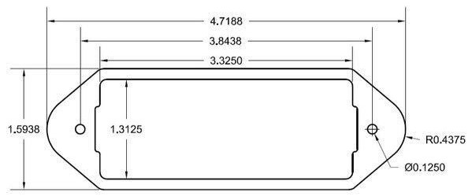

# guitar pickup spacer

A workmate wanted a spacer printed for his guitar pickup, and tossed me this reference:

So I designed up this lil model to match! Printed at ~50% infill since I want it to be strong, and there's 3mm, 5mm, and 7mm high versions attached.

## License

The `pickup-spacer.scad` file is released under CC0, public domain. I didn't make the design of the original pickup so yeah.
